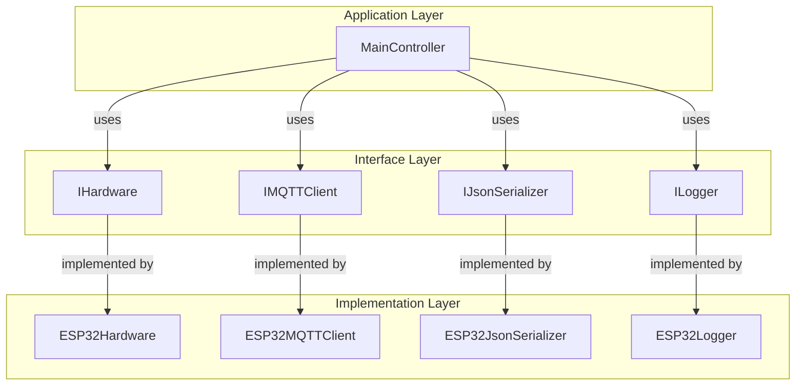
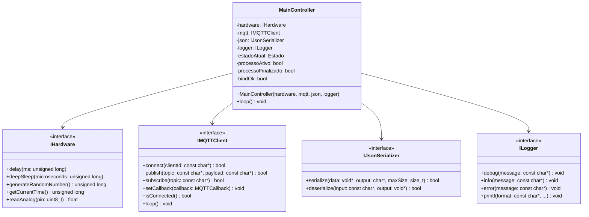
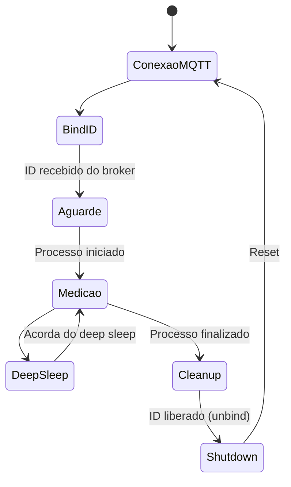

# Documentação do Sistema Embarcado

## Arquitetura

### Visão Geral das Camadas



### Diagrama de Classes



## Máquina de Estados



## Testando o Sistema

### Pré-requisitos
- CMake (versão 3.10 ou superior)
- Compilador C++ com suporte a C++17
- Biblioteca nlohmann-json3-dev
- Build tools (make, gcc, etc.)

### Instalação das Dependências (Ubuntu)
```bash
sudo apt update
sudo apt install cmake build-essential nlohmann-json3-dev
```

### Compilando e Executando os Testes

1. Navegue até o diretório de testes:
```bash
cd src/embedded/test
```

2. Crie e entre no diretório de build:
```bash
mkdir build
cd build
```

3. Configure o CMake e compile:
```bash
cmake ..
make
```

4. Execute os testes:
```bash
./test_controller
```

### O que é Testado

O sistema de testes utiliza implementações mock (simuladas) das interfaces principais:

- **MockHardware**: Simula operações de hardware como delay, deep sleep e leitura analógica
- **MockMQTT**: Simula comunicação MQTT, permitindo testar o protocolo de bind/unbind
- **MockJSON**: Simula serialização/deserialização JSON
- **MockLogger**: Simula o sistema de logging

O teste simula um ciclo completo de operação:
1. Conexão MQTT
2. Processo de bind
3. Início do processo de medição
4. Execução de algumas medições
5. Finalização do processo
6. Cleanup e shutdown

### Logs Esperados

Durante a execução do teste, você deve ver logs similares a:
```
[MockMQTT] Connected with ID: ESP32Client
[INFO] Conectado ao MQTT.
[MockMQTT] Subscribed to: sensores/processo
[MockMQTT] Subscribed to: sensores/bind/response
[MockMQTT] Published to sensores/bind/request: {"req_id":"...","nome":"esp32_1"}
[MockMQTT] Sending bind response: {"req_id":"...","id":"TEST_ID_001","status":"ok"}
...
```

## Estrutura de Arquivos

```
src/embedded/
├── include/
│   ├── hal/
│   │   └── hardware_interface.h
│   ├── comm/
│   │   ├── mqtt_interface.h
│   │   └── mqtt_types.h
│   ├── utils/
│   │   ├── logger_interface.h
│   │   ├── json_interface.h
│   │   └── string_utils.h
│   └── MainController.h
├── impl/
│   └── esp32/
│       ├── esp32_hardware.cpp
│       ├── esp32_hardware.h
│       ├── esp32_mqtt.cpp
│       ├── esp32_mqtt.h
│       ├── esp32_json.cpp
│       └── esp32_json.h
├── test/
│   ├── CMakeLists.txt
│   ├── mock_implementations.h
│   └── test_controller.cpp
└── esp.ino
```