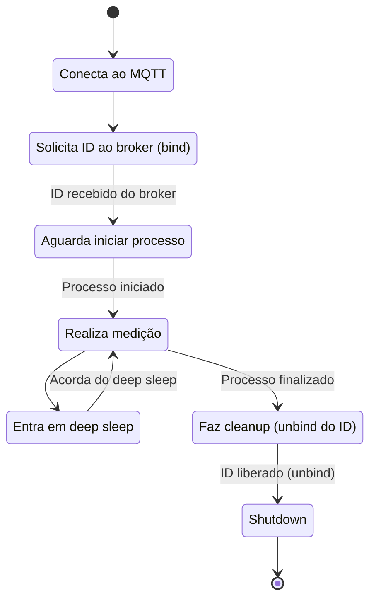

```mermaid
stateDiagram
  direction TB
  [*] --> ConexaoMQTT
  ConexaoMQTT --> BindID
  BindID --> Aguarde:ID recebido do broker
  Aguarde --> Medicao:Processo iniciado
  Medicao --> DeepSleep
  DeepSleep --> Medicao:Acorda do deep sleep
  Medicao --> Cleanup:Processo finalizado
  Cleanup --> Shutdown:ID liberado (unbind)
  Shutdown --> [*]

  %% Descrição dos estados
  ConexaoMQTT:Conecta ao MQTT
  BindID:Solicita ID ao broker (bind)
  Aguarde:Aguarda iniciar processo
  Medicao:Realiza medição
  DeepSleep:Entra em deep sleep
  Cleanup:Faz cleanup (unbind do ID)
  Shutdown:Shutdown
```